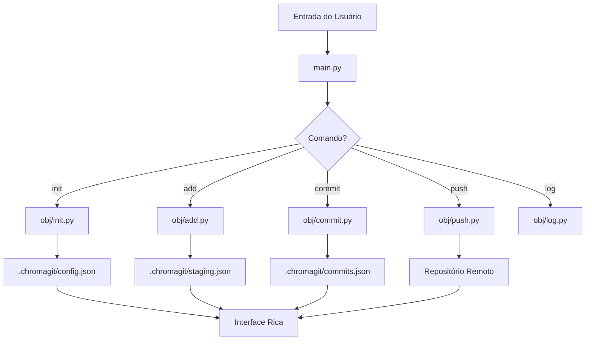

# 🔧 Guia do Desenvolvedor - ChromaGit

## Arquitetura do Sistema

O ChromaGit foi projetado com uma arquitetura modular e extensível, seguindo princípios de clean code e separação de responsabilidades.

## 🏗️ Estrutura do Projeto

```
ChromaGit/
├── main.py                    # Ponto de entrada principal
├── obj/                       # Módulos core do sistema
│   ├── init.py               # Inicialização de repositórios
│   ├── add.py                # Sistema de staging
│   ├── commit.py             # Criação e gerenciamento de commits
│   ├── log.py                # Visualização de histórico
│   ├── push.py               # Sincronização remota
│   ├── help.py               # Sistema de ajuda
│   └── *.exe                 # Executáveis compilados
├── cli/                       # Interface CLI alternativa
│   └── chromagit.py          # Interface unificada
├── docs/                      # Documentação
├── .chromagit/               # Dados do repositório
│   ├── config.json           # Configurações
│   ├── staging.json          # Área de staging
│   ├── commits.json          # Histórico de commits
│   └── backups/              # Backups automáticos
└── utils/                     # Utilitários auxiliares
```

## 🔨 Componentes Principais

### 1. main.py - Interface Unificada

O arquivo principal que orquestra toda a aplicação:

```python
class ChromaGitMain:
    def __init__(self):
        self.version = "1.0.0"
        self.name = "ChromaGit"
        self.commands = {...}  # Mapeamento de comandos
        
    def interactive_mode(self):
        # Modo interativo com Rich UI
        
    def run_command(self, command, args):
        # Execução de comandos via subprocess
```

**Responsabilidades:**
- Routing de comandos
- Interface interativa
- Validação de argumentos
- Gerenciamento de estado

### 2. Sistema de Comandos (obj/)

Cada comando é um módulo independente que pode ser executado via script Python ou executável compilado.

#### init.py - Inicialização
```python
def initialize_repository(force=False, name=None):
    """Inicializa um novo repositório ChromaGit"""
    # Cria estrutura .chromagit/
    # Configura arquivos base
    # Define metadados
```

#### add.py - Sistema de Staging
```python
def add_files(patterns, recursive=False):
    """Adiciona arquivos ao staging"""
    # Resolve padrões de arquivos
    # Aplica regras .gitignore
    # Atualiza staging.json
```

#### commit.py - Commits
```python
def create_commit(message, author=None, stats=False):
    """Cria um novo commit"""
    # Gera hash SHA-256
    # Captura metadados
    # Cria backup
    # Atualiza histórico
```

#### push.py - Sincronização
```python
def push_repository(project_name=None, force=False):
    """Sincroniza com repositório remoto"""
    # Lê configuração .env
    # Organiza em subpastas
    # Transfer arquivos
    # Atualiza status
```

## 🔄 Fluxo de Dados



## 🗃️ Estrutura de Dados

### config.json
```json
{
    "name": "MeuProjeto",
    "created_at": "2025-09-09T10:30:00Z",
    "version": "1.0.0",
    "author": "Usuario",
    "remote": {
        "configured": true,
        "last_push": "2025-09-09T11:00:00Z"
    }
}
```

### staging.json
```json
{
    "files": [
        {
            "path": "src/main.py",
            "hash": "abc123...",
            "size": 1024,
            "modified": "2025-09-09T10:45:00Z"
        }
    ],
    "total_files": 1,
    "last_updated": "2025-09-09T10:45:00Z"
}
```

### commits.json
```json
{
    "commits": [
        {
            "hash": "sha256_hash",
            "message": "Primeira versão",
            "author": "Usuario",
            "timestamp": "2025-09-09T11:00:00Z",
            "files": ["src/main.py"],
            "stats": {
                "files_changed": 1,
                "lines_added": 50,
                "lines_removed": 0
            }
        }
    ],
    "total_commits": 1,
    "last_commit": "sha256_hash"
}
```

## 🎨 Sistema de Interface

### Rich Console
O ChromaGit usa a biblioteca Rich para interfaces coloridas:

```python
from rich.console import Console
from rich.panel import Panel
from rich.table import Table
from rich.progress import Progress

console = Console()

# Panels para informações
panel = Panel("Conteúdo", title="Título", border_style="blue")

# Tabelas para dados estruturados
table = Table(title="Comandos")
table.add_column("Comando", style="cyan")
table.add_column("Status", style="green")

# Progress para operações longas
with Progress() as progress:
    task = progress.add_task("Processando...", total=100)
```

### Padrões de UI
- **Panels**: Informações importantes
- **Tables**: Dados estruturados
- **Progress**: Operações longas
- **Prompts**: Entrada interativa
- **Cores**: Verde (sucesso), Vermelho (erro), Azul (info)

## 🔨 Processo de Build

### Compilação de Executáveis
```bash
# Compilar módulo específico
pyinstaller --onefile obj/init.py --distpath obj

# Compilar interface principal
pyinstaller --onefile main.py --distpath obj

# Build completo
python build_all.py
```

### Estrutura de Build
```python
# build_all.py
def build_module(module_name):
    """Compila um módulo específico"""
    cmd = f"pyinstaller --onefile obj/{module_name}.py --distpath obj"
    subprocess.run(cmd, shell=True)

modules = ['init', 'add', 'commit', 'log', 'push', 'help']
for module in modules:
    build_module(module)
```

## 🧪 Testes

### Estrutura de Testes
```
tests/
├── test_init.py          # Testes de inicialização
├── test_add.py           # Testes de staging
├── test_commit.py        # Testes de commits
├── test_push.py          # Testes de sincronização
├── test_integration.py   # Testes de integração
└── fixtures/             # Dados de teste
```

### Exemplo de Teste
```python
import pytest
import tempfile
from pathlib import Path
from obj.init import initialize_repository

def test_initialize_repository():
    with tempfile.TemporaryDirectory() as temp_dir:
        os.chdir(temp_dir)
        
        result = initialize_repository(name="TestRepo")
        
        assert result["success"] is True
        assert Path(".chromagit").exists()
        assert Path(".chromagit/config.json").exists()
```

## 🔧 Extensibilidade

### Adicionando Novos Comandos

1. **Criar módulo**: `obj/meu_comando.py`
```python
#!/usr/bin/env python3
import sys
from pathlib import Path

def execute_command(args):
    """Implementa a lógica do comando"""
    # Sua implementação aqui
    return {"success": True, "message": "Comando executado"}

if __name__ == "__main__":
    result = execute_command(sys.argv[1:])
    print(result["message"])
    sys.exit(0 if result["success"] else 1)
```

2. **Registrar no main.py**:
```python
self.commands = {
    # ... comandos existentes
    'meu_comando': {
        'script': 'meu_comando.py',
        'exe': 'meu_comando.exe',
        'description': 'Descrição do meu comando',
        'color': 'purple',
        'icon': '🎯'
    }
}
```

3. **Compilar**: `pyinstaller --onefile obj/meu_comando.py --distpath obj`

### Hooks e Plugins

O sistema suporta hooks para extensões:

```python
# hooks.py
def pre_commit_hook(files):
    """Executado antes de cada commit"""
    pass

def post_push_hook(result):
    """Executado após push"""
    pass
```

## 🐛 Debug e Logging

### Sistema de Logs
```python
import logging

logging.basicConfig(
    level=logging.INFO,
    format='%(asctime)s - %(name)s - %(levelname)s - %(message)s',
    handlers=[
        logging.FileHandler('.chromagit/debug.log'),
        logging.StreamHandler()
    ]
)

logger = logging.getLogger('chromagit')
```

### Debug Interativo
```bash
# Modo debug
python main.py --debug

# Verbose
python main.py commit -m "test" --verbose

# Dry-run
python main.py push --dry-run
```

## 📦 Distribuição

### Criando Releases
```bash
# Build completo
python build_all.py

# Criar pacote
python setup.py sdist bdist_wheel

# Upload para PyPI
twine upload dist/*
```

### Estrutura de Release
```
release/
├── ChromaGit-v1.0.0/
│   ├── main.exe              # Windows
│   ├── main                  # Linux/macOS
│   ├── obj/                  # Módulos compilados
│   ├── docs/                 # Documentação
│   └── install.sh            # Script de instalação
```

## 🔄 Contribuindo

### Setup do Ambiente de Desenvolvimento
```bash
git clone https://github.com/marcosgomes068/ChromaGit.git
cd ChromaGit
poetry install --dev
pre-commit install
```

### Padrões de Código
- **PEP 8**: Estilo de código Python
- **Type Hints**: Anotações de tipo
- **Docstrings**: Documentação de funções
- **Tests**: Cobertura mínima de 80%

### Workflow de Contribuição
1. Fork do repositório
2. Branch feature/fix
3. Desenvolvimento + testes
4. Pull request
5. Review + merge

## 🚀 Roadmap

### Versão 1.1
- [ ] Sistema de branches
- [ ] Merge de branches
- [ ] Resolução de conflitos
- [ ] Interface gráfica

### Versão 1.2
- [ ] Plugin system
- [ ] Hooks personalizados
- [ ] API REST
- [ ] Dashboard web

### Versão 2.0
- [ ] Distribuição peer-to-peer
- [ ] Sync em tempo real
- [ ] Colaboração multi-usuário
- [ ] Integração com Git
